# 📧 SaleSmartly 邮件群发优化方案 v3

> **核心洞察：** 发送方式不是用户的主观偏好，而是基于**受众特征**和**费用预算**的客观决策

---

## 🎯 创建路径设计

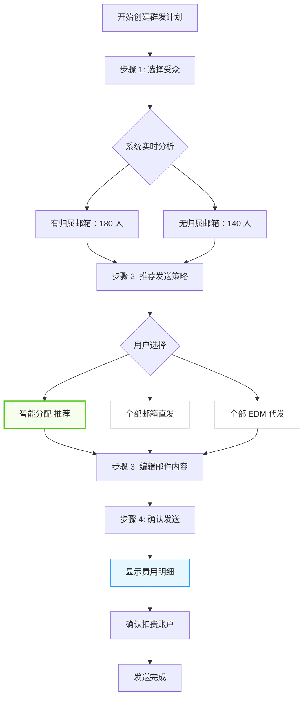

---

## 📊 决策矩阵：受众特征 → 推荐策略

| 场景 | 受众特征 | 推荐方案 | 费用 | 送达率 | 原因 |
|------|---------|---------|------|--------|------|
| 🎯 销售跟进 | 客户有归属邮箱 | 归属邮箱发送 | 免费 | 85% | 销售个人跟进，品牌一致性 |
| 📮 小批量营销 | <500 人，无归属 | 邮箱直发 | 免费 | 85% | 在限额内，成本最优 |
| 🤖 中批量营销 | 500-2000 人 | **智能混合** | 部分收费 | 98%+ | 平衡成本和送达率 |
| 🚀 大批量营销 | >2000 人 | EDM 代发 | 收费 | 99%+ | 避免封号，送达率高 |
| ⭐ 重要通知 | 高价值客户 <100 | 邮箱直发 | 免费 | 85% | 品牌信任度优先 |

---

## 🎨 界面交互流程

### 步骤 1：选择受众

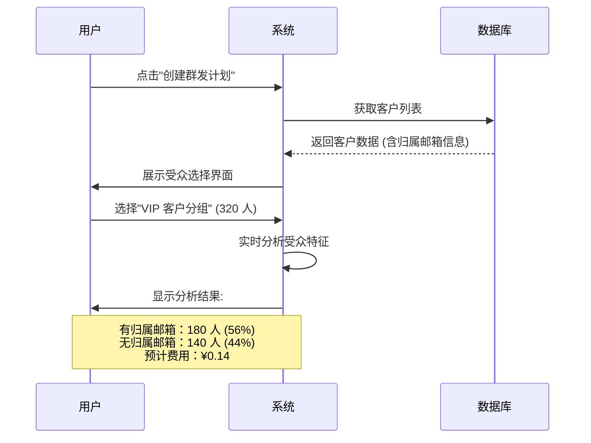

**界面原型：**

```
┌─────────────────────────────────────────────────────────┐
│  创建群发计划 - 步骤 1/4                                 │
├─────────────────────────────────────────────────────────┤
│                                                         │
│  选择发送对象 ①                                         │
│  ● 全部客户 (5,280 人)                                  │
│  ○ 客户分组 [VIP 客户 ▼] (320 人)  ← 已选              │
│  ○ 手动选择 (已选 0 人)                                 │
│  ○ 导入客户 [上传 CSV]                                  │
│                                                         │
│  ┌───────────────────────────────────────────────────┐ │
│  │  📊 受众分析（实时）                               │ │
│  ├───────────────────────────────────────────────────┤ │
│  │  总人数：320 人                                    │ │
│  │  ┌─────────────────────────────────────────────┐  │ │
│  │  │  有归属邮箱：████████████░░░░  180 人 (56%)  │  │ │
│  │  │  无归属邮箱：██████░░░░░░░░░░  140 人 (44%)  │  │ │
│  │  └─────────────────────────────────────────────┘  │ │
│  │                                                   │ │
│  │  发送策略预览：                                   │ │
│  │  🤖 智能分配（推荐）                              │ │
│  │  • 180 人 → 归属邮箱发送（免费）                  │ │
│  │  • 140 人 → EDM 代发（¥0.14）                     │ │
│  │  ─────────────────────────────────────────────── │ │
│  │  预计总费用：¥0.14                                │ │
│  │  预计送达率：98%+                                 │ │
│  └───────────────────────────────────────────────────┘ │
│                                                         │
│              [上一步]    [下一步：确认发送策略]         │
└─────────────────────────────────────────────────────────┘
```

---

### 步骤 2：发送策略选择

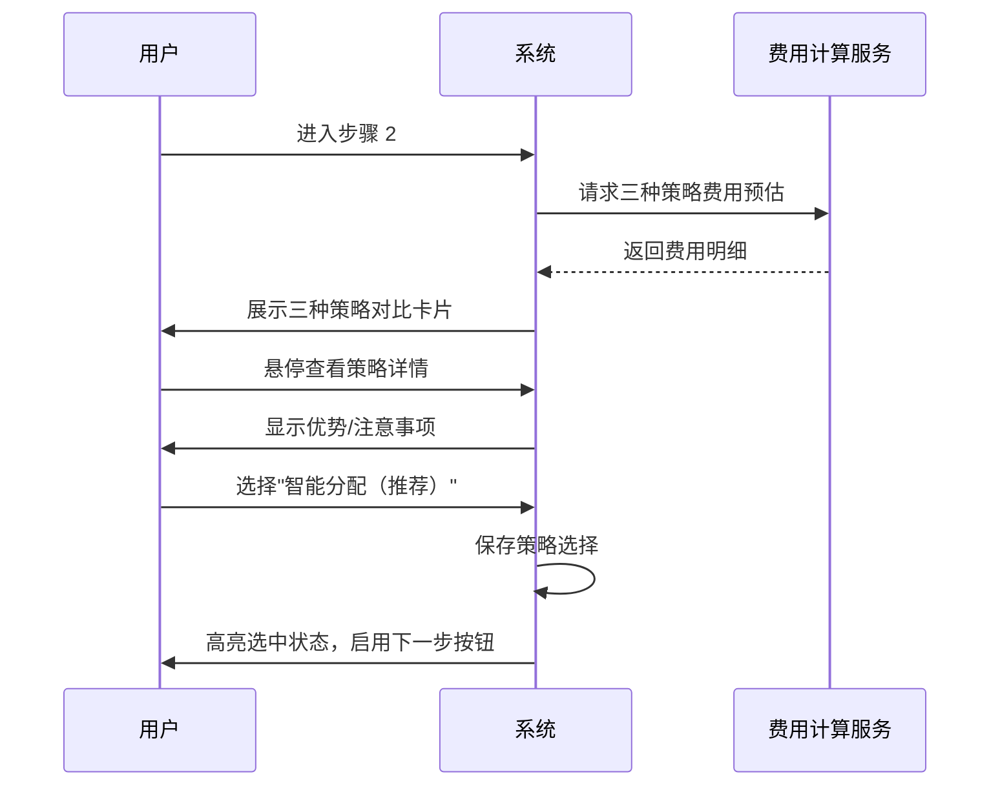

**界面原型：**

```
┌─────────────────────────────────────────────────────────┐
│  创建群发计划 - 步骤 2/4                                 │
├─────────────────────────────────────────────────────────┤
│                                                         │
│  选择发送策略 ⭐                                        │
│                                                         │
│  ┌───────────────────────────────────────────────────┐ │
│  │  🤖 智能分配（推荐）                     [已选择] │ │
│  ├───────────────────────────────────────────────────┤ │
│  │  • 180 人 → 归属邮箱发送（免费）                  │ │
│  │  • 140 人 → EDM 代发（¥0.14）                     │ │
│  │                                                   │ │
│  │  ✅ 优势：                                        │ │
│  │  • 成本最优（仅 44% 需要付费）                     │ │
│  │  • 送达率高（98%+）                               │ │
│  │  • 有归属客户体验更好（销售个人邮箱）             │ │
│  │                                                   │ │
│  │  💰 预计总费用：¥0.14                             │ │
│  │  📬 预计送达率：98%+                              │ │
│  └───────────────────────────────────────────────────┘ │
│                                                         │
│  ┌───────────────────────────────────────────────────┐ │
│  │  📧 全部邮箱直发                                   │ │
│  ├───────────────────────────────────────────────────┤ │
│  │  • 320 人 → 集成邮箱发送                          │ │
│  │                                                   │ │
│  │  ✅ 优势：                                        │ │
│  │  • 完全免费                                      │ │
│  │  • 品牌一致性最好                                │ │
│  │                                                   │ │
│  │  ⚠️ 注意：                                       │ │
│  │  • 接近日发送限额（500 封/天）                     │ │
│  │  • 送达率可能较低（85% 左右）                     │ │
│  │                                                   │ │
│  │  💰 预计总费用：¥0.00                             │ │
│  │  📬 预计送达率：85%                               │ │
│  └───────────────────────────────────────────────────┘ │
│                                                         │
│  ┌───────────────────────────────────────────────────┐ │
│  │  🚀 全部 EDM 代发                                  │ │
│  ├───────────────────────────────────────────────────┤ │
│  │  • 320 人 → EDM 专业通道发送                      │ │
│  │                                                   │ │
│  │  ✅ 优势：                                        │ │
│  │  • 送达率最高（99%+）                            │ │
│  │  • 不消耗自有邮箱信誉                            │ │
│  │  • 无发送限额                                    │ │
│  │                                                   │ │
│  │  💰 预计总费用：¥0.32                             │ │
│  │  📬 预计送达率：99%+                              │ │
│  └───────────────────────────────────────────────────┘ │
│                                                         │
│              [上一步]    [下一步：编辑邮件内容]         │
└─────────────────────────────────────────────────────────┘
```

---

### 步骤 3：编辑邮件内容

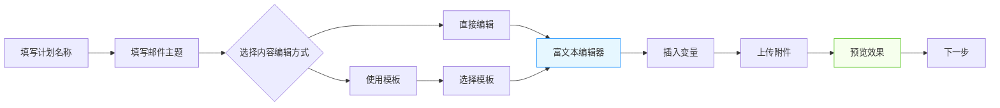

**界面原型：**

```
┌─────────────────────────────────────────────────────────┐
│  创建群发计划 - 步骤 3/4                                 │
├─────────────────────────────────────────────────────────┤
│                                                         │
│  计划名称                                               │
│  ┌─────────────────────────────────────────────────┐   │
│  │  双 12 VIP 客户促销通知                    12/50 │   │
│  └─────────────────────────────────────────────────┘   │
│                                                         │
│  邮件主题                                               │
│  ┌─────────────────────────────────────────────────┐   │
│  │  【VIP 专享】双 12 提前购，5 折起！          18/100│   │
│  └─────────────────────────────────────────────────┘   │
│                                                         │
│  邮件内容  ● 直接编辑  ○ 使用模板                      │
│  ┌─────────────────────────────────────────────────┐   │
│  │  文件  编辑  查看  插入  格式  工具  表格       │   │
│  │  ↶ ↷  段落▼  14px▼  B I A▼  🎨  ≡ ≡ ≡        │   │
│  │  ∷ ∷  🔗  田▼  ─  <>  Ix  ⛶  [插入变量]      │   │
│  ├─────────────────────────────────────────────────┤   │
│  │  尊敬的 {客户姓名}，                             │   │
│  │                                                 │   │
│  │  感谢您一直以来的支持...                        │   │
│  │                                                 │   │
│  │  [预览效果]                                     │   │
│  └─────────────────────────────────────────────────┘   │
│           [+ 话术库]                                    │
│                                                         │
│  邮件附件                                               │
│  ┌──────────┐  ┌──────────┐                            │
│  │  + 上传  │  │ 产品册   │                            │
│  │          │  │ .pdf     │                            │
│  └──────────┘  └──────────┘                            │
│                                                         │
│  ────────────────────────────────────────────────────  │
│  当前发送策略：智能分配                                 │
│  受众：320 人  |  预计费用：¥0.14  [修改]               │
│  ────────────────────────────────────────────────────  │
│                                                         │
│              [上一步]    [下一步：确认发送]             │
└─────────────────────────────────────────────────────────┘
```

---

### 步骤 4：确认发送

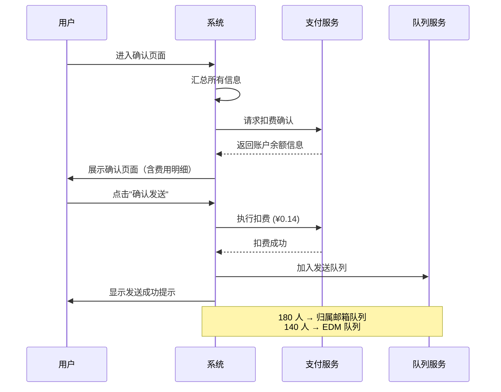

**界面原型：**

```
┌─────────────────────────────────────────────────────────┐
│  创建群发计划 - 步骤 4/4                                 │
├─────────────────────────────────────────────────────────┤
│                                                         │
│  请确认发送信息                                         │
│                                                         │
│  ┌───────────────────────────────────────────────────┐ │
│  │  计划名称：双 12 VIP 客户促销通知                  │ │
│  │  邮件主题：【VIP 专享】双 12 提前购，5 折起！      │ │
│  │  受众总数：320 人                                  │ │
│  │  发送策略：智能分配                                │ │
│  │    • 归属邮箱发送：180 人（免费）                 │ │
│  │    • EDM 代发：140 人（¥0.14）                    │ │
│  └───────────────────────────────────────────────────┘ │
│                                                         │
│  ┌───────────────────────────────────────────────────┐ │
│  │  💰 费用确认                                       │ │
│  ├───────────────────────────────────────────────────┤ │
│  │  预计费用：¥0.14（140 封 × ¥0.001/封）            │ │
│  │  扣费账户：[余额账户 ▼]                           │ │
│  │  当前余额：¥1,250.00                              │ │
│  │  发送后余额：¥1,249.86                            │ │
│  │                                                   │ │
│  │  [充值]  [查看账单]                               │ │
│  └───────────────────────────────────────────────────┘ │
│                                                         │
│  发送时间                                               │
│  ● 立即发送                                             │
│  ○ 定时发送 [2026-04-03 10:00 ▼]                      │
│  ○ 分批发送 [每批 50 人] [间隔 10 分钟]                │
│                                                         │
│  □ 我已阅读并同意《邮件营销服务条款》                  │
│                                                         │
│              [上一步]        [确认发送]                 │
└─────────────────────────────────────────────────────────┘
```

---

## 💰 费用统计模块

### 计划列表

```
┌────────────────────────────────────────────────────────────────────┐
│  群发计划列表                                                       │
├────────────────────────────────────────────────────────────────────┤
│  筛选：[全部状态▼] [发送方式▼] [时间范围▼]  [🔍 搜索计划名称...]  │
├────────────────────────────────────────────────────────────────────┤
│  计划名称    │ 发送数 │ 方式    │ 费用   │ 送达率 │ 状态   │ 操作 │
├────────────────────────────────────────────────────────────────────┤
│  双 12 促销   │ 5,280  │ 智能分配│ ¥5.28  │ 98.5%  │ 已完成│ 查看 │
│  VIP 通知    │ 320    │ 智能分配│ ¥0.14  │ 99.1%  │ 已完成│ 查看 │
│  新品上线    │ 150    │ 邮箱直发│ ¥0.00  │ 87.2%  │ 已完成│ 查看 │
│  黑五预热    │ 2,100  │ EDM 代发│ ¥2.10  │ 99.3%  │ 发送中│ 查看 │
│  圣诞活动    │ 800    │ 智能分配│ ¥0.32  │ -      │ 待发送│ 编辑 │
└────────────────────────────────────────────────────────────────────┘

┌─────────────────────────────────────────────────────────┐
│  📊 本月累计                                             │
│  发送总数：12,850 封                                    │
│  EDM 代发：8,650 封                                     │
│  邮箱直发：4,200 封                                     │
│  累计费用：¥128.50                                      │
└─────────────────────────────────────────────────────────┘
```

### 账户余额管理

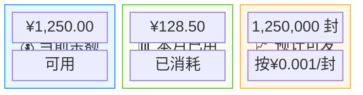

```
┌─────────────────────────────────────────────────────────┐
│  账户管理                                                │
├─────────────────────────────────────────────────────────┤
│  当前余额：¥1,250.00                                    │
│  本月已用：¥128.50                                      │
│  预计可用：约 1,250,000 封（按¥0.001/封）               │
│                                                         │
│  [立即充值]  [查看账单]  [设置预警]                     │
│                                                         │
│  充值记录：                                             │
│  ┌───────────────────────────────────────────────────┐ │
│  │  2026-04-01  充值  ¥500.00   支付宝  ✅ 已完成   │ │
│  │  2026-03-15  充值  ¥1,000.00 微信   ✅ 已完成   │ │
│  │  2026-03-01  充值  ¥500.00   支付宝  ✅ 已完成   │ │
│  └───────────────────────────────────────────────────┘ │
│                                                         │
│  费用预警设置：                                         │
│  □ 余额低于 ¥100 时提醒                                │
│  □ 单日费用超过 ¥50 时提醒                             │
│  □ 月度费用超过 ¥500 时提醒                            │
└─────────────────────────────────────────────────────────┘
```

---

## 🔧 数据模型变更

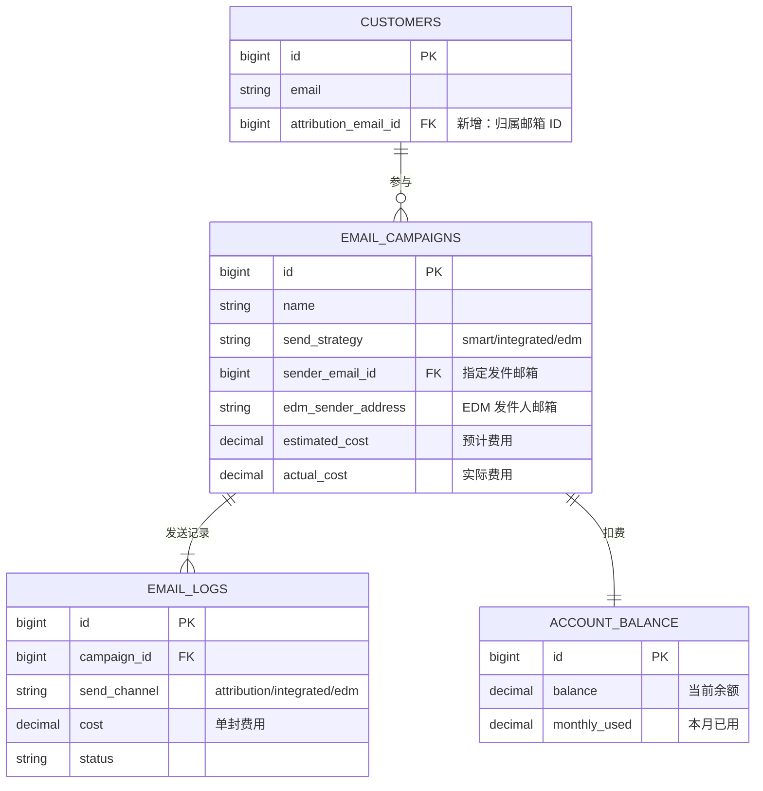

### 字段说明

| 表名 | 字段 | 类型 | 说明 |
|------|------|------|------|
| `customers` | `attribution_email_id` | BIGINT | 客户归属邮箱 ID（关联已集成邮箱） |
| `email_campaigns` | `send_strategy` | VARCHAR(20) | 发送策略：smart/integrated/edm |
| `email_campaigns` | `sender_email_id` | BIGINT | 指定发件邮箱 ID（邮箱直发时） |
| `email_campaigns` | `edm_sender_address` | VARCHAR(255) | EDM 代发发件人邮箱 |
| `email_campaigns` | `estimated_cost` | DECIMAL(10,2) | 预计费用 |
| `email_campaigns` | `actual_cost` | DECIMAL(10,2) | 实际费用 |
| `email_logs` | `send_channel` | VARCHAR(20) | 实际发送通道 |
| `email_logs` | `cost` | DECIMAL(10,4) | 单封费用 |
| `account_balance` | `balance` | DECIMAL(10,2) | 账户余额 |
| `account_balance` | `monthly_used` | DECIMAL(10,2) | 本月已用金额 |

---

## ⚙️ 核心算法：发送策略推荐

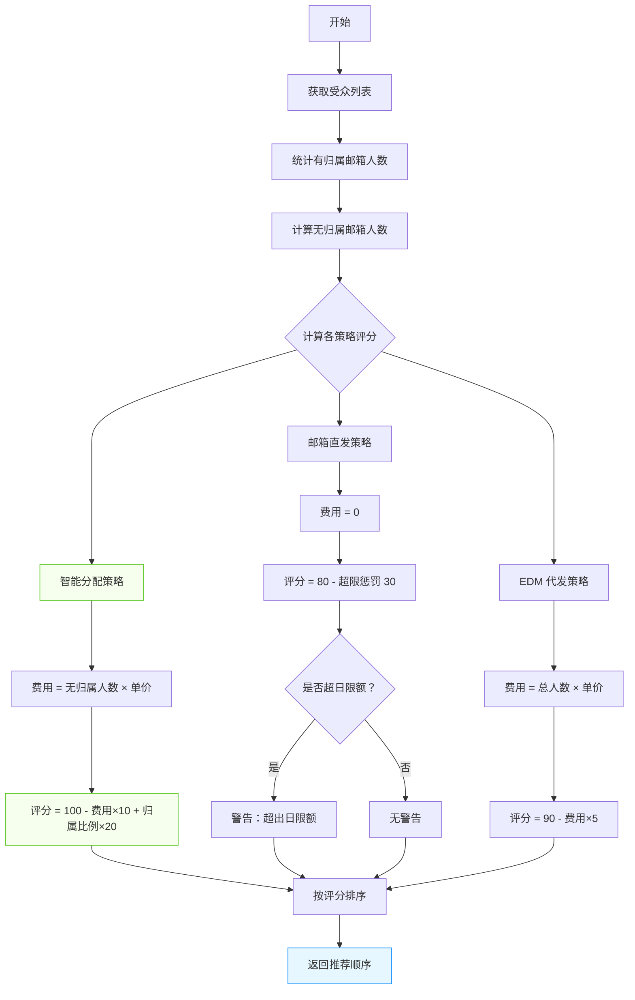

### 伪代码

```javascript
function recommendSendStrategy(audience, settings) {
    const total = audience.length;
    const withAttribution = audience.filter(c => c.attributionEmailId).length;
    const withoutAttribution = total - withAttribution;
    
    const strategies = [];
    
    // 方案 1: 智能分配
    const smartCost = withoutAttribution * settings.edmPricePerEmail;
    strategies.push({
        type: 'smart',
        cost: smartCost,
        deliveryRate: 0.98,
        score: 100 - (smartCost * 10) + (withAttribution / total * 20),
        desc: `${withAttribution}人归属邮箱 + ${withoutAttribution}人 EDM`
    });
    
    // 方案 2: 全部邮箱直发
    const integratedCost = 0;
    const integratedWarning = total > settings.dailyLimit ? '超出日限额' : null;
    strategies.push({
        type: 'integrated',
        cost: integratedCost,
        deliveryRate: 0.85,
        warning: integratedWarning,
        score: 80 - (total > settings.dailyLimit ? 30 : 0),
        desc: `${total}人全部邮箱直发（免费）`
    });
    
    // 方案 3: 全部 EDM
    const edmCost = total * settings.edmPricePerEmail;
    strategies.push({
        type: 'edm',
        cost: edmCost,
        deliveryRate: 0.99,
        score: 90 - (edmCost * 5),
        desc: `${total}人全部 EDM 代发`
    });
    
    // 按评分排序，返回推荐顺序
    return strategies.sort((a, b) => b.score - a.score);
}
```

---

## 📈 关键指标对比

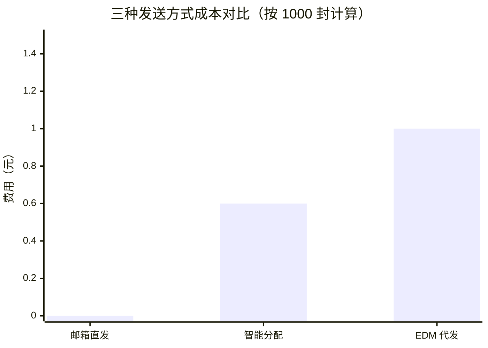

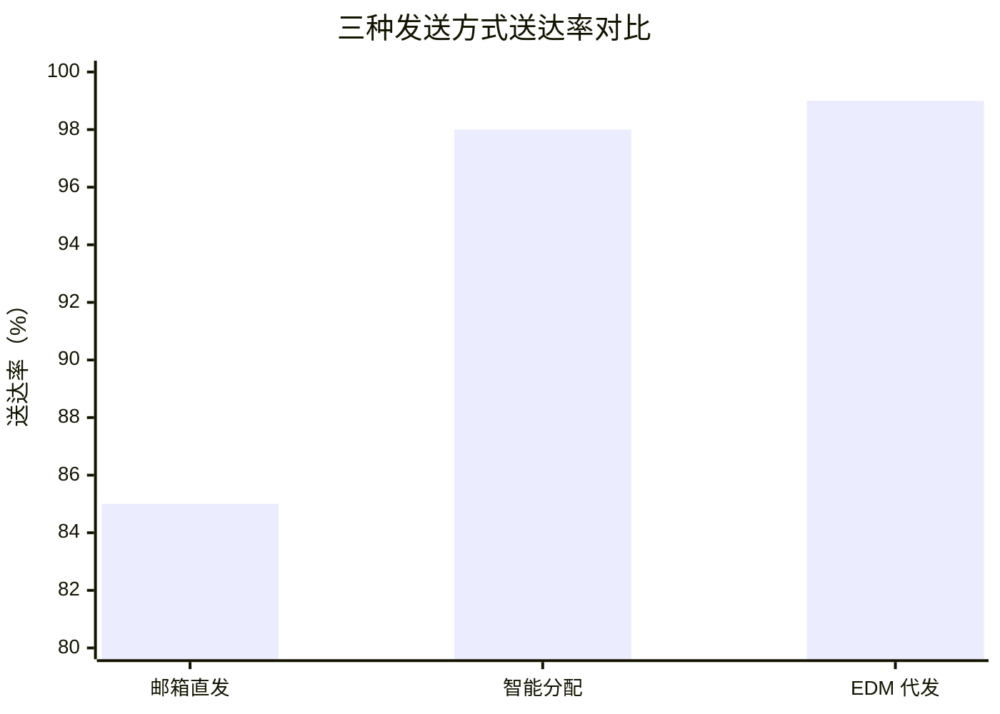

| 能力 | 邮箱直发 | EDM 代发 | 智能分配 |
|------|---------|---------|---------|
| **单封成本** | ¥0.00 | ¥0.001 | 混合（约 40-60% 免费） |
| **日发送限额** | 500-2000 封 | 无限制 | 部分受限 |
| **送达率** | 85% | 99%+ | 98%+ |
| **品牌一致性** | 高（自有域名） | 中（可配置） | 高（归属客户用自有） |
| **邮箱信誉影响** | 消耗信誉 | 无影响 | 部分消耗 |
| **适用场景** | 小批量、重要客户 | 大批量营销 | 混合客户群体 |

---

## 🎯 方案优势总结

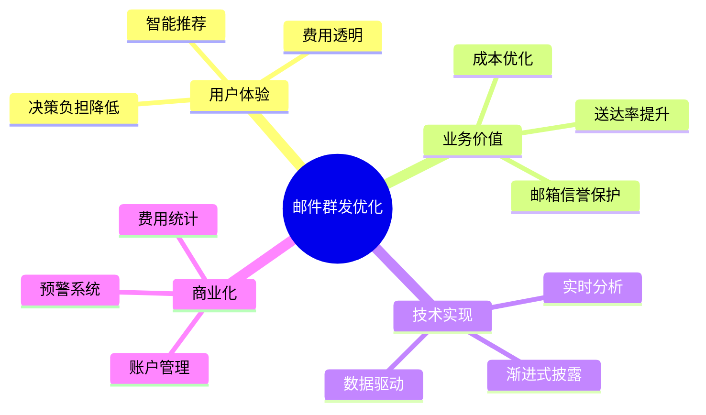

### 核心价值

1. **✅ 受众驱动决策** — 基于数据而非拍脑袋
2. **✅ 费用实时透明** — 发送前就知道要花多少钱
3. **✅ 智能推荐** — 降低用户认知负担，但保留覆盖权
4. **✅ 渐进式披露** — 只在需要时展示高级配置
5. **✅ 完整统计** — 计划级别 + 账户级别费用追踪

---

## 📝 下一步行动

- [ ] 评审交互方案
- [ ] 确认费用单价（¥0.001/封？）
- [ ] 评估开发工作量
- [ ] 排期开发
- [ ] 测试上线
