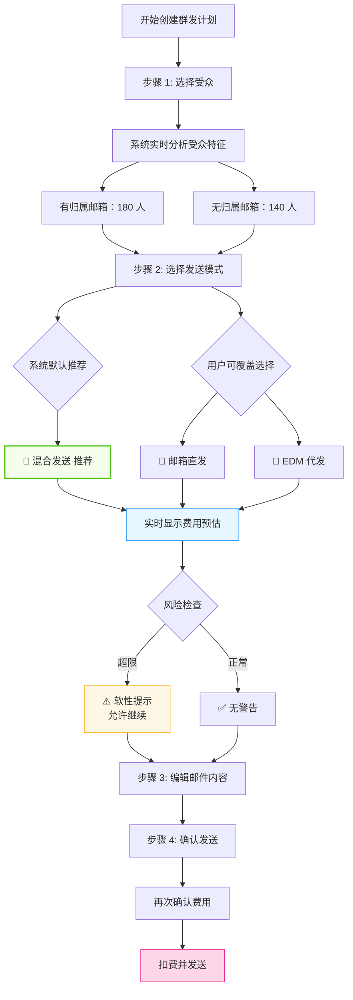
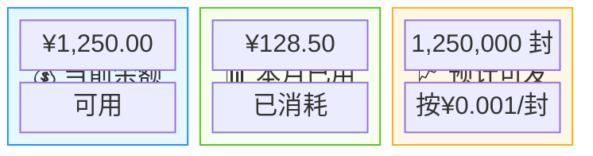
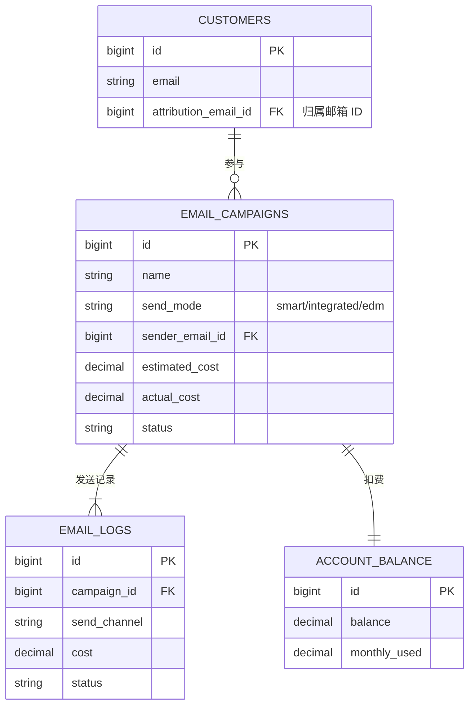

# 📧 SaleSmartly 邮件群发优化方案 v4

> **核心原则：** 数据驱动决策 + 用户主权 + 费用透明 + 软性提示

---

## 🎯 创建流程设计



**关键设计决策：**

| 设计点 | 说明 |
|--------|------|
| ✅ 先选受众 | 基于真实数据推荐，避免拍脑袋决策 |
| ✅ 默认推荐 | 系统根据受众特征自动选择最优模式 |
| ✅ 允许覆盖 | 用户可以手动切换，但会看到风险提示 |
| ✅ 软性提示 | 不硬限制，只告知风险（如超限、送达率低） |
| ✅ 费用透明 | 每一步都显示实时费用预估 |

---

## 📊 决策矩阵：受众特征 → 推荐模式

| 场景 | 受众特征 | 系统推荐 | 费用 | 送达率 | 用户可覆盖为 |
|------|---------|---------|------|--------|-------------|
| 🎯 销售跟进 | 客户有归属邮箱 | 混合发送 | 部分免费 | 98%+ | 邮箱直发/EDM |
| 📮 小批量营销 | <500 人，无归属 | 邮箱直发 | 免费 | 85% | 混合/EDM |
| 🤖 中批量营销 | 500-2000 人 | **混合发送** | 部分收费 | 98%+ | 邮箱直发⚠️/EDM |
| 🚀 大批量营销 | >2000 人 | EDM 代发 | 收费 | 99%+ | 混合⚠️ |
| ⭐ 重要通知 | 高价值客户 <100 | 邮箱直发 | 免费 | 85% | 混合/EDM |

> ⚠️ 表示覆盖时会有风险提示

---

## 🎨 界面交互流程

### 步骤 1：选择受众

**界面原型：**

```
┌─────────────────────────────────────────────────────────┐
│  创建群发计划 - 步骤 1/4                                 │
│  ← 返回                                                 │
├─────────────────────────────────────────────────────────┤
│                                                         │
│  选择发送对象 ①                                         │
│                                                         │
│  ┌───────────────────────────────────────────────────┐ │
│  │  ○ 全部客户 (5,280 人)                            │ │
│  │  ● 客户分组 [VIP 客户 ▼] (320 人)  ← 已选        │ │
│  │  ○ 手动选择 (已选 0 人)                           │ │
│  │  ○ 导入客户 [上传 CSV]                            │ │
│  └───────────────────────────────────────────────────┘ │
│                                                         │
│  ┌───────────────────────────────────────────────────┐ │
│  │  📊 受众分析（实时）                               │ │
│  ├───────────────────────────────────────────────────┤ │
│  │  总人数：320 人                                    │ │
│  │                                                   │ │
│  │  ┌─────────────────────────────────────────────┐  │ │
│  │  │  有归属邮箱：████████████░░░░░  180 人 (56%) │  │ │
│  │  │  无归属邮箱：██████░░░░░░░░░░  140 人 (44%)  │  │ │
│  │  └─────────────────────────────────────────────┘  │ │
│  │                                                   │ │
│  │  系统推荐：🤖 混合发送（推荐）                     │ │
│  │  预计费用：¥0.14（140 封 × ¥0.001）               │ │
│  │  预计送达率：98%+                                 │ │
│  └───────────────────────────────────────────────────┘ │
│                                                         │
│              [保存草稿]    [下一步：选择发送模式 →]     │
└─────────────────────────────────────────────────────────┘
```

---

### 步骤 2：选择发送模式（核心优化点）

**界面原型：**

```
┌─────────────────────────────────────────────────────────┐
│  创建群发计划 - 步骤 2/4                                 │
├─────────────────────────────────────────────────────────┤
│                                                         │
│  已选受众：VIP 客户分组（320 人）                        │
│  • 有归属邮箱：180 人（56%）                            │
│  • 无归属邮箱：140 人（44%）                            │
│                                                         │
│  选择发送模式 ⭐  [什么是发送模式？]                    │
│                                                         │
│  ┌───────────────────────────────────────────────────┐ │
│  │  🤖 混合发送（推荐）                     [已选择] │ │
│  ├───────────────────────────────────────────────────┤ │
│  │  发送逻辑：                                        │ │
│  │  • 有归属邮箱客户 → 使用归属邮箱发送（免费）      │ │
│  │  • 无归属邮箱客户 → 使用 EDM 代发（¥0.14）        │ │
│  │                                                   │ │
│  │  ✅ 优势：                                        │ │
│  │  • 成本最优（仅 44% 需要付费）                     │ │
│  │  • 送达率高（98%+）                               │ │
│  │  • 有归属客户体验更好（销售个人邮箱）             │ │
│  │                                                   │ │
│  │  💰 预计费用：¥0.14                               │ │
│  │  📬 预计送达率：98%+                              │ │
│  │  ⏱️ 预计发送时长：5 分钟                          │ │
│  └───────────────────────────────────────────────────┘ │
│                                                         │
│  ┌───────────────────────────────────────────────────┐ │
│  │  📧 邮箱直发                                       │ │
│  ├───────────────────────────────────────────────────┤ │
│  │  发送逻辑：                                        │ │
│  │  • 全部 320 人使用已集成邮箱发送                   │ │
│  │                                                   │ │
│  │  ✅ 优势：                                        │ │
│  │  • 完全免费                                      │ │
│  │  • 品牌一致性最好                                │ │
│  │                                                   │ │
│  │  ⚠️ 注意：                                       │ │
│  │  • 接近日发送限额（500 封/天）                    │ │
│  │  • 送达率可能较低（85% 左右）                     │ │
│  │  • 可能触发邮箱服务商风控                         │ │
│  │                                                   │ │
│  │  💰 预计费用：¥0.00                               │ │
│  │  📬 预计送达率：85%                               │ │
│  │  ⏱️ 预计发送时长：8 分钟                          │ │
│  │                                                   │ │
│  │  [仍选择此模式]                                   │ │
│  └───────────────────────────────────────────────────┘ │
│                                                         │
│  ┌───────────────────────────────────────────────────┐ │
│  │  🚀 EDM 代发                                       │ │
│  ├───────────────────────────────────────────────────┤ │
│  │  发送逻辑：                                        │ │
│  │  • 全部 320 人使用 EDM 专业通道发送                │ │
│  │                                                   │ │
│  │  ✅ 优势：                                        │ │
│  │  • 送达率最高（99%+）                            │ │
│  │  • 不消耗自有邮箱信誉                            │ │
│  │  • 无发送限额                                    │ │
│  │                                                   │ │
│  │  💰 预计费用：¥0.32                               │ │
│  │  📬 预计送达率：99%+                              │ │
│  │  ⏱️ 预计发送时长：3 分钟                          │ │
│  └───────────────────────────────────────────────────┘ │
│                                                         │
│  ────────────────────────────────────────────────────  │
│  当前选择：混合发送  |  预计费用：¥0.14  |  320 人      │
│  ────────────────────────────────────────────────────  │
│                                                         │
│              [← 上一步]    [下一步：编辑邮件内容 →]     │
└─────────────────────────────────────────────────────────┘
```

---

### 步骤 3：编辑邮件内容

**界面原型：**

```
┌─────────────────────────────────────────────────────────┐
│  创建群发计划 - 步骤 3/4                                 │
├─────────────────────────────────────────────────────────┤
│                                                         │
│  计划名称 *                                             │
│  ┌─────────────────────────────────────────────────┐   │
│  │  双 12 VIP 客户促销通知                    12/50 │   │
│  └─────────────────────────────────────────────────┘   │
│                                                         │
│  邮件主题 *                                             │
│  ┌─────────────────────────────────────────────────┐   │
│  │  【VIP 专享】双 12 提前购，5 折起！          18/100│   │
│  └─────────────────────────────────────────────────┘   │
│                                                         │
│  邮件内容 *  ● 直接编辑  ○ 使用模板                    │
│                                                         │
│  ┌─────────────────────────────────────────────────┐   │
│  │  文件  编辑  查看  插入  格式  工具  表格       │   │
│  │  ↶ ↷  段落▼  14px▼  B I A▼  🎨  ≡ ≡ ≡        │   │
│  │  ∷ ∷  🔗  田▼  ─  <>  Ix  ⛶  [插入变量▼]     │   │
│  ├─────────────────────────────────────────────────┤   │
│  │  尊敬的 {客户姓名}，                             │   │
│  │                                                 │   │
│  │  感谢您一直以来的支持...                        │   │
│  │                                                 │   │
│  │  [预览效果]                                     │   │
│  └─────────────────────────────────────────────────┘   │
│           [+ 话术库]  [+ 产品卡片]                      │
│                                                         │
│  邮件附件                                               │
│  ┌──────────┐  ┌──────────┐                            │
│  │  + 上传  │  │ 产品册   │  [替换] [删除]             │
│  │          │  │ .pdf     │                            │
│  └──────────┘  └──────────┘                            │
│                                                         │
│  ────────────────────────────────────────────────────  │
│  当前发送模式：🤖 混合发送                              │
│  受众：320 人  |  预计费用：¥0.14  [修改]               │
│  ────────────────────────────────────────────────────  │
│                                                         │
│              [← 上一步]    [下一步：确认发送 →]         │
└─────────────────────────────────────────────────────────┘
```

---

### 步骤 4：确认发送

**界面原型：**

```
┌─────────────────────────────────────────────────────────┐
│  创建群发计划 - 步骤 4/4                                 │
├─────────────────────────────────────────────────────────┤
│                                                         │
│  请确认发送信息                                         │
│                                                         │
│  ┌───────────────────────────────────────────────────┐ │
│  │  📋 计划信息                                       │ │
│  ├───────────────────────────────────────────────────┤ │
│  │  计划名称：双 12 VIP 客户促销通知                  │ │
│  │  邮件主题：【VIP 专享】双 12 提前购，5 折起！      │ │
│  │  受众总数：320 人                                  │ │
│  │  发送模式：🤖 混合发送                            │ │
│  │    • 归属邮箱发送：180 人（免费）                 │ │
│  │    • EDM 代发：140 人（¥0.14）                    │ │
│  └───────────────────────────────────────────────────┘ │
│                                                         │
│  ┌───────────────────────────────────────────────────┐ │
│  │  💰 费用确认                                       │ │
│  ├───────────────────────────────────────────────────┤ │
│  │  预计费用：¥0.14（140 封 × ¥0.001/封）            │ │
│  │  扣费账户：[余额账户 ▼]                           │ │
│  │  当前余额：¥1,250.00                              │ │
│  │  发送后余额：¥1,249.86                            │ │
│  │                                                   │ │
│  │  [充值]  [查看账单]                               │ │
│  └───────────────────────────────────────────────────┘ │
│                                                         │
│  发送时间 *                                             │
│  ┌───────────────────────────────────────────────────┐ │
│  │  ● 立即发送                                       │ │
│  │  ○ 定时发送 [2026-04-03 10:00 ▼]                 │ │
│  │  ○ 分批发送 [每批 50 人] [间隔 10 分钟]           │ │
│  └───────────────────────────────────────────────────┘ │
│                                                         │
│  □ 我已阅读并同意《邮件营销服务条款》                  │
│                                                         │
│  ────────────────────────────────────────────────────  │
│  ⚠️ 发送后无法撤回，请确认信息无误                     │
│  ────────────────────────────────────────────────────  │
│                                                         │
│              [← 上一步]        [确认发送]               │
└─────────────────────────────────────────────────────────┘
```

---

## 💰 费用统计模块

### 计划列表

```
┌────────────────────────────────────────────────────────────────────────┐
│  群发计划列表                                                           │
├────────────────────────────────────────────────────────────────────────┤
│  筛选：[全部状态▼] [发送模式▼] [时间范围▼]  [🔍 搜索计划名称...]      │
├────────────────────────────────────────────────────────────────────────┤
│  计划名称    │ 发送数 │ 模式    │ 费用   │ 送达率 │ 状态   │ 操作    │
├────────────────────────────────────────────────────────────────────────┤
│  双 12 促销   │ 5,280  │ 混合    │ ¥5.28  │ 98.5%  │ 已完成│ 查看   │
│  VIP 通知    │ 320    │ 混合    │ ¥0.14  │ 99.1%  │ 已完成│ 查看   │
│  新品上线    │ 150    │ 直发    │ ¥0.00  │ 87.2%  │ 已完成│ 查看   │
│  黑五预热    │ 2,100  │ EDM     │ ¥2.10  │ 99.3%  │ 发送中│ 查看   │
│  圣诞活动    │ 800    │ 混合    │ ¥0.32  │ -      │ 待发送│ 编辑   │
└────────────────────────────────────────────────────────────────────────┘

┌─────────────────────────────────────────────────────────┐
│  📊 本月累计                                             │
│  发送总数：12,850 封                                    │
│  邮箱直发：4,200 封（免费）                            │
│  EDM 代发：8,650 封                                     │
│  累计费用：¥128.50                                      │
└─────────────────────────────────────────────────────────┘
```

### 账户余额管理



---

## 🔧 数据模型



### 字段说明

| 表名 | 字段 | 类型 | 说明 |
|------|------|------|------|
| `customers` | `attribution_email_id` | BIGINT | 客户归属邮箱 ID |
| `email_campaigns` | `send_mode` | VARCHAR(20) | 发送模式：smart/integrated/edm |
| `email_campaigns` | `estimated_cost` | DECIMAL(10,2) | 预计费用 |
| `email_campaigns` | `actual_cost` | DECIMAL(10,2) | 实际费用 |
| `email_logs` | `send_channel` | VARCHAR(20) | 实际发送通道 |
| `email_logs` | `cost` | DECIMAL(10,4) | 单封费用 |
| `account_balance` | `balance` | DECIMAL(10,2) | 当前余额 |
| `account_balance` | `monthly_used` | DECIMAL(10,2) | 本月已用金额 |

---

## ⚙️ 核心算法

### 评分算法伪代码

```javascript
function calculateModeScore(mode, audience, settings) {
    const total = audience.length;
    const withAttribution = audience.filter(c => c.attributionEmailId).length;
    const withoutAttribution = total - withAttribution;
    
    let cost = 0;
    let deliveryRate = 0;
    let riskScore = 0;
    
    switch (mode) {
        case 'smart':
            cost = withoutAttribution * settings.edmPricePerEmail;
            deliveryRate = 0.98;
            riskScore = 0;
            break;
        case 'integrated':
            cost = 0;
            deliveryRate = 0.85;
            riskScore = total > settings.dailyLimit ? 30 : 0;
            break;
        case 'edm':
            cost = total * settings.edmPricePerEmail;
            deliveryRate = 0.99;
            riskScore = 0;
            break;
    }
    
    const score = 100 - (cost * 10) - riskScore - ((1 - deliveryRate) * 50);
    
    return { mode, cost, deliveryRate, riskScore, score };
}

function recommendSendMode(audience, settings) {
    const modes = ['smart', 'integrated', 'edm'];
    const scores = modes.map(mode => 
        calculateModeScore(mode, audience, settings)
    );
    return scores.sort((a, b) => b.score - a.score);
}
```

---

## 📈 关键指标对比

| 能力 | 邮箱直发 | EDM 代发 | 混合发送 |
|------|---------|---------|---------|
| **单封成本** | ¥0.00 | ¥0.001 | 混合（约 40-60% 免费） |
| **日发送限额** | 500-2000 封 | 无限制 | 部分受限 |
| **送达率** | 85% | 99%+ | 98%+ |
| **品牌一致性** | 高 | 中 | 高 |
| **邮箱信誉影响** | 消耗 | 无影响 | 部分消耗 |
| **适用场景** | 小批量、重要客户 | 大批量营销 | 混合客户群体 |

---

## 🎯 v4 方案优势总结

### 对比 v3 的改进

| 维度 | v3 | v4 |
|------|----|----|
| **模式选择时机** | 步骤 2（系统推荐） | 步骤 2（用户可选，默认推荐） |
| **限制方式** | 无限制 | 软性提示（警告但允许） |
| **用户主权** | 系统推荐为主 | 推荐 + 可覆盖 |
| **风险提示** | 静态展示 | 动态触发（切换时实时显示） |
| **费用透明** | 步骤 2 显示 | 每步都显示 |

### 核心价值

1. **✅ 数据驱动** — 基于受众特征推荐最优模式
2. **✅ 用户主权** — 允许覆盖推荐，但透明展示风险
3. **✅ 费用透明** — 每一步都知道要花多少钱
4. **✅ 软性提示** — 不硬限制，只告知风险
5. **✅ 完整统计** — 计划 + 账户级别费用追踪

---

## 📝 下一步行动

- [ ] 评审交互方案
- [ ] 确认费用单价（¥0.001/封？）
- [ ] 评估开发工作量
- [ ] 排期开发
- [ ] 测试上线
